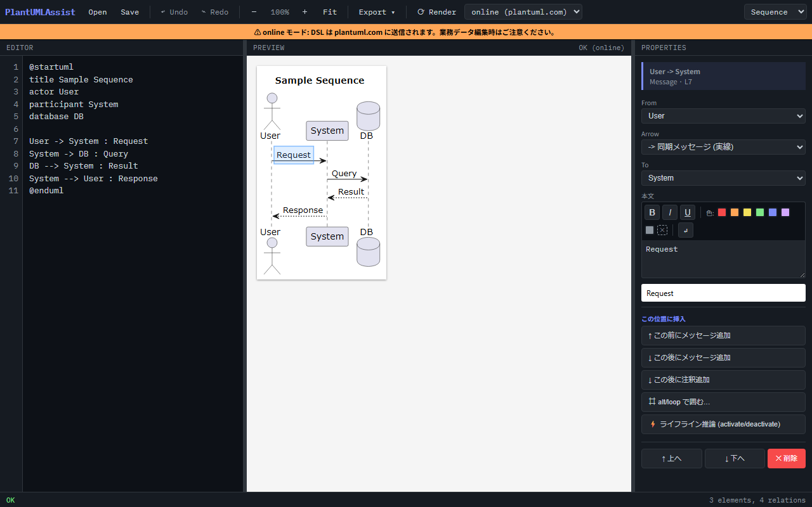
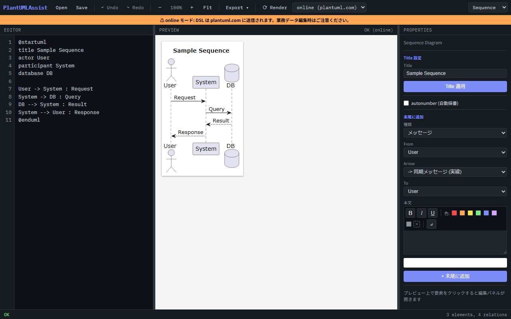
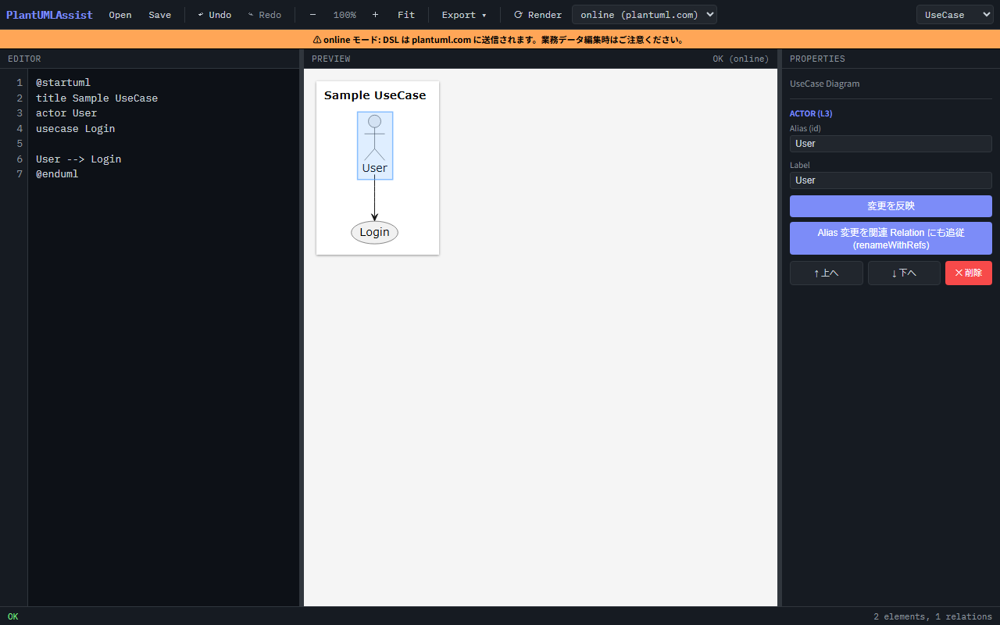
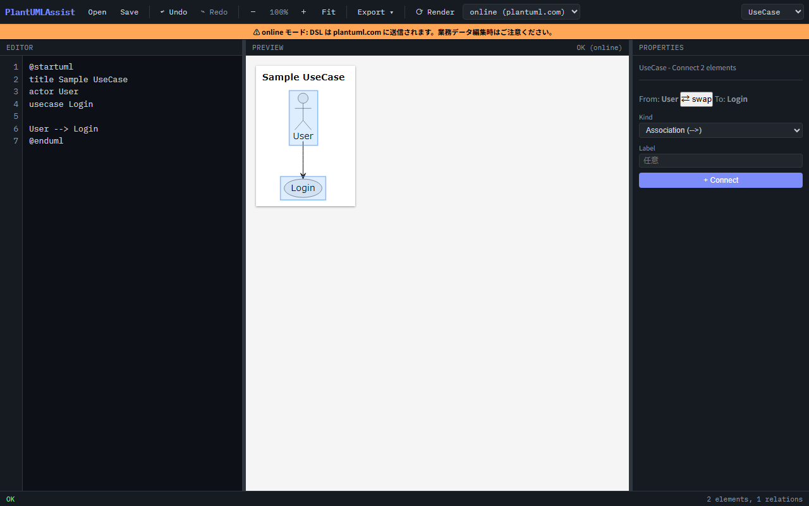
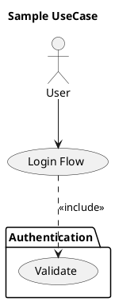
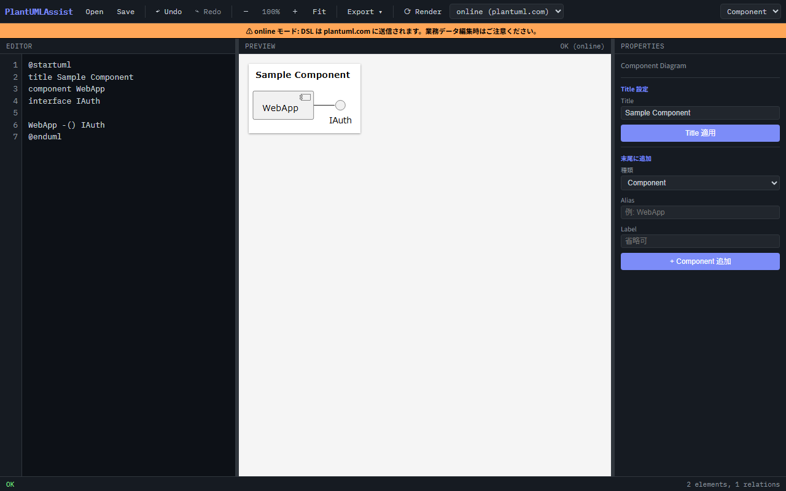
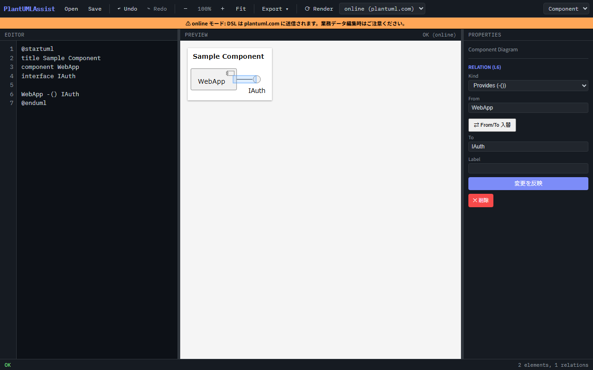
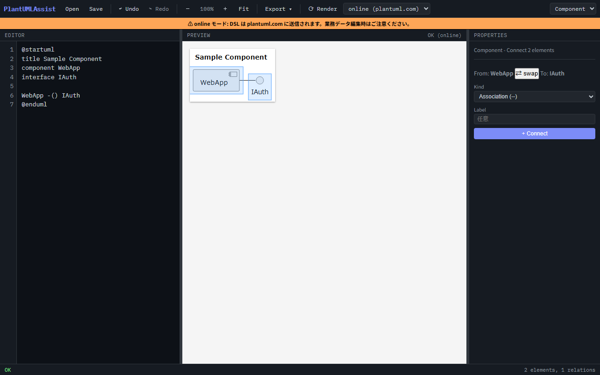
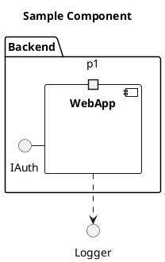
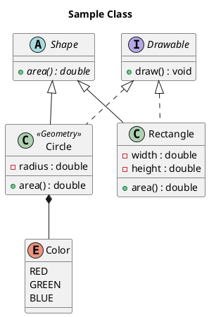

# PlantUMLAssist

PlantUML 記法の **GUI 編集ツール**。Python バックエンド + HTML/JS フロント。[MermaidAssist](../05_MermaidAssist) の sister project。


DSL を直接書かなくても、SVG 上の図形をクリック / プロパティパネルからフォーム入力で UML 図を作成・編集できます。

## 特徴

- **Tier1 ロードマップ**: Sequence / Use Case / Component / Class の 4 図形が利用可能 (Activity / State は v0.7.0 以降)
- **3 種類の編集スタイル** を組み合わせて使える
  - DSL エディタで直接編集 (左ペイン)
  - フォームから追加 (右ペイン下部の「末尾に追加」)
  - **SVG プレビュー上の図形をクリック** (overlay-driven、v0.5.0)
- **local (Java daemon) / online (plantuml.com)** 両モード対応。`local` モードは常駐 JVM で 10〜30ms/render
- **DiagramModule v2** インターフェース (MermaidAssist 踏襲)
- DSL エディタは Tab/Shift+Tab でインデント挿入、Ctrl+Z/Ctrl+Y で Undo/Redo

## できること

### Sequence Diagram

参加者間のメッセージのやり取りを時系列で記述する図。


- メッセージを **クリックで選択** → kind 切替 / ラベル編集 / 削除 / Undo
- 「末尾に追加」フォームから participant / メッセージ / note / alt-loop ブロック / activate を追加
- 行間にホバーで `+ ここに挿入` ガイドが出る → クリックで途中挿入 popup
- Participant を SVG 上で **drag して並び替え**
- Note / alt / loop / opt / par / break / critical ブロックの後付け囲み

メッセージ選択時の編集パネル:



無選択時のフォーム (kind selector で対象種別を切替):



### UseCase Diagram (v0.3.0)

要求分析・ハザード分析・規格対応で使う actor / usecase / package の図。


#### 対応 DSL 要素

- `actor` (キーワード形式 / 短縮 `:Label:`)
- `usecase` (キーワード形式 / 短縮 `(Label)`)
- `package "Label" { ... }` 境界 (`rectangle` も同義として受理)
- 4 種の関係:
  - association `A --> B` (label 任意)
  - generalization `A <|-- B` (parent <|-- child 方向)
  - include `A ..> B : <<include>>`
  - extend `A ..> B : <<extend>>`

#### 図形をクリックして編集

actor / usecase / package / relation を **SVG 上でクリック** すると右パネルが編集モードに切替わる。



#### Multi-Select Connect (v0.5.0)

**Shift+クリックで 2 つの図形を選択** すると Connect form が出て、関係種別を選んで `+ Connect` で線を引ける。tail-add フォームで From/To を選び直す手間を省略できる。



#### Canonical 出力 (ADR-105)

GUI からの編集はすべて keyword-first canonical 形式で emit (例: `actor "Power User" as PU`)。短縮記法 (`:X:` / `(L)`) は parser で受理しますが、保存時に正規化されます。

#### サンプル DSL



### Component Diagram (v0.4.0)

システムブロック構成・モジュール依存・インターフェース表現の図。



#### 対応 DSL 要素

- `component` (キーワード形式 / 短縮 `[X]`)
- `interface` (キーワード形式 / 短縮 `() X`)
- `port` (component の `{ }` block 内に配置)
- `package "Label" { ... }` 境界 (`folder`/`frame`/`node`/`rectangle` も同義として受理)
- 4 種の関係:
  - association `A -- B` (label 任意)
  - dependency `A ..> B` (label 任意)
  - provides (lollipop) `component -() interface`
  - requires (lollipop) `interface )- component`

#### Relation 編集

矢印を **クリックで選択** → kind 切替 (associatian ↔ dependency ↔ lollipop) / from/to swap / ラベル編集 / 削除。



#### Multi-Select Connect (4 kind)

UseCase と同じ multi-select connect。Component は **provides/requires が方向固定** (component → interface) なので、kind 切替時に自動で from/to を入れ替えます。



#### Port 階層追加

「末尾に追加」で kind=Port を選ぶと **Parent component** セレクタが出る。component が自動で `{ }` block 形式に変換され、port が中に配置される (PlantUML が要求する正規構造)。


#### Canonical 出力 (ADR-106)

GUI からの編集はすべて keyword-first canonical 形式で emit (例: `component "Web App" as WA`)。短縮記法 (`[X]` / `() X` / `folder/frame/node/rectangle`) は parser で受理しますが、保存時に正規化されます。

#### サンプル DSL



### Class Diagram (v0.6.0)

OO 設計で頻出。class / interface / abstract class / enum + 6 種関係 + member (attribute / method) を編集可能。

#### 対応 DSL 要素

- `class` (キーワード形式 / quoted label)
- `interface` (専用キーワード優先、`<<interface>>` stereotype は parse-only)
- `abstract class` (2 トークン強制)
- `enum` (block 必須)
- 6 種の関係:
  - association `--`
  - inheritance `<|--` (parent <|-- child)
  - implementation `<|..` (interface <|.. class)
  - composition `*--` (container *-- contained)
  - aggregation `o--` (container o-- part)
  - dependency `..>`
- Stereotype `<<X>>`
- Generics `Foo<T>`, `Map<K, V>`
- Nesting: `package "Label" {}` + `namespace foo {}`

#### Member 編集

class / interface / abstract を **クリックで選択** → property panel に attribute / method リストが表示。各行に削除ボタン。`+ Attribute 追加` / `+ Method 追加` で visibility / static / abstract / 型 を入力するフォームが展開。

#### Multi-Select Connect (6 kind)

UseCase / Component と同じ Shift+click 流儀。Class は **6 種の関係** から選択。implementation は方向固定 (interface → class)、kind 切替時に自動 swap。

#### Canonical 出力 (ADR-107)

GUI 編集はすべて keyword-first canonical 形式で emit (例: `abstract class Shape <<Geometry>>`)。短縮形式 / 揺れ形式 (`abstract Foo` / `class Foo <<interface>>` / 順序揺れ等) は parser で受理しますが保存時に正規化。

#### サンプル DSL



#### v0.6.0 制約 (v0.6.1+ で対応予定)

- Member 個別 SVG クリック選択 (現在は class 全体選択 → panel 内 member リスト)
- 内部クラス (class 内 class 定義)
- Note on class

### v0.6.1 — Class polish (Member click + Note on class)

- **Member 個別 click**: SVG 上の attribute / method / enum-value 行を直接クリック → 該当 member の inline edit が auto-expand
- **Note on class**: 1 行 / 複数行 directional note を property panel から作成・編集・削除。class 削除時に紐付く note も自動削除
- **Activity v0.7.0 へ向けた API**: `extractMultiLineTextBBoxes` を `core/overlay-builder` に汎化、複数行 text の per-line bbox 取得を共通化

### v0.7.0 — Activity Diagram (Tier1 #5)

- **新記法 primary** (`start` / `:action;` / `if/while/repeat/fork`) + legacy parse-only
- **制御構造**: if/elseif/else/endif、while/endwhile、repeat/repeat while、fork/fork again/end fork
- **Swimlane** (`|name|`) + **Note** (`note right` / `note left`、1行+複数行)
- **Overlay-driven** (action rect / decision diamond / start-stop ellipse / fork bar)
- ADR-109: canonical form 確定

## Overlay-Driven Editing 共通操作 (v0.5.0)

Sequence / UseCase / Component のすべてで以下が共通:

- **クリック**: 図形を単一選択 → property panel が編集モードに
- **再クリック**: 選択解除 (toggle)
- **Shift+クリック**: 複数選択 (UseCase / Component で 2 つまで → Connect form 表示)
- **空白クリック**: 選択解除

## v0.6.0 制約 (v0.7.0+ で対応予定)

- drag-to-connect (SVG 上で線を drag して関係作成)
- package 範囲選択 → wrap (既存要素を package で囲む)
- 要素を別 package へ drag 移動
- Sequence の multi-select connect (現状 Sequence は form-based のみ)
- Class diagram の SVG 上 member 個別クリック選択
- Activity / State の各 diagram

## セットアップ

> **初回のみ**: リポジトリには PlantUML jar を同梱していません (ライセンス整合性のため)。
> 下記いずれかで `lib/plantuml.jar` を配置してください。

```bash
# macOS / Linux / WSL / Git Bash
bash lib/fetch-plantuml.sh

# Windows PowerShell
.\lib\fetch-plantuml.ps1
```

または PlantUML 公式リリース (https://github.com/plantuml/plantuml/releases) から任意のライセンス変種 (GPLv3 / LGPL / Apache 2.0 / EPL / MIT / BSD) を手動ダウンロードして `lib/plantuml.jar` として配置してください。詳細は `lib/README.md` を参照。

## 起動

> **重要**: MermaidAssist と違い、HTML をダブルクリックしても動きません。PlantUML は Java 実行または plantuml.com への POST を必要とするため、Python バックエンド経由でアクセスしてください。

```bash
cd 06_PlantUMLAssist
python server.py
```

コンソールに `PlantUMLAssist server starting on http://127.0.0.1:8766` と表示されたら、ブラウザで **http://127.0.0.1:8766/** を開きます。

Windows では `start.bat` をダブルクリックでも起動可能 (server.py を起動してブラウザを自動で開きます)。

**自動停止**: ブラウザタブを閉じるとサーバーも自動で停止します (heartbeat 方式、タブ close 後 2〜6秒以内に終了)。F5 リロードは自動判定で継続。明示的に止めたい場合は `Ctrl+C`。

## 要件

- Python 3 (標準ライブラリのみ、追加パッケージ不要)
- **Java 11 以降 推奨** (常駐 JVM daemon モードで高速化)
  - Java 8〜10 でも動作可能だが、自動的に毎回 JVM 起動する従来モード (低速) にフォールバック
  - online モードのみ使うなら Java 不要
- `lib/plantuml.jar` (**別途ダウンロード必要**、fetch スクリプト提供。推奨: v1.2026.2、約 22 MB)
- `lib/PlantUMLDaemon.java` (リポジトリ同梱、ビルド不要 — Java 11+ の single-file source-launcher が直接実行)

Java がインストールされていない場合は、UI 右上の `render-mode` セレクトを `online (plantuml.com)` に切替えて使用可能。plantuml.com の公開サーバを利用するため、**業務データは外部送信される** ことに注意。

### Java バージョン別の挙動

| バージョン | 動作 | 初回 render | 2回目以降 |
|---|---|---|---|
| **Java 11+** (推奨) | 常駐 daemon モード。JVM を1回だけ起動して stdin/stdout pipe 通信 | ~400ms (JVM warmup) | **~10-30ms** |
| Java 8 / 9 / 10 | 従来モード (自動フォールバック)。毎回 `java -jar plantuml.jar -pipe` を起動 | ~1.5s | ~1.5s |
| Java 未インストール | local モード使用不可。online モードは使用可 | — | — |

daemon モードでは **ネットワークソケットを一切開きません** (pipe 通信のみ)。外部から daemon プロセスにアクセスすることは OS レベルで不可能です。

### トラブルシューティング

| 症状 | 原因 | 対策 |
|---|---|---|
| "Render error: Failed to fetch" | server.py が起動していない / HTML を `file://` で開いている | `python server.py` を起動し、`http://127.0.0.1:8766/` にアクセス |
| "java not found" (local mode) | Java 未インストール | JDK/JRE 11+ をインストール (Java 8-10 でも動作するが低速)、または online モードへ切替 |
| local mode で毎回数秒かかる | Java 10 以下で daemon モードが起動できず従来モードにフォールバック | Java 11 以降 (LTS: 11 / 17 / 21) にアップグレード推奨 |
| "online render failed: HTTP 4xx/5xx" | plantuml.com のレート制限/障害 | 時間をおいて再試行、または local モードへ切替 |

## テスト

```bash
npm install
npm run test:unit   # Node runner — 308 unit tests
npm run test:e2e    # Playwright — 80 E2E tests
npm run test:all
```

## 設計ドキュメント

- **Tier1 master spec**: `docs/superpowers/specs/2026-04-24-plantuml-tier1-complete-master.md`
- **v0.3.0 (UseCase)**: `docs/superpowers/specs/2026-04-25-usecase-design.md` / `plans/2026-04-25-usecase-v0.3.0.md`
- **v0.4.0 (Component + S1.5)**: `docs/superpowers/specs/2026-04-25-component-design.md` / `plans/2026-04-25-component-v0.4.0.md`
- **v0.5.0 (Overlay-driven)**: `docs/superpowers/specs/2026-04-26-tier1-overlay-driven-design.md` / `plans/2026-04-26-tier1-overlay-driven-v0.5.0.md`
- **直接操作 UX チェックリスト**: `docs/direct-manipulation-ux-checklist.md`
- ADR: `docs/adr/` (ADR-101+)
- ECN: `docs/ecn/`

## ライセンス

本リポジトリは **MIT** (`LICENSE` 参照)。

`lib/plantuml.jar` は同梱していません。利用者が PlantUML 公式から任意のライセンス変種 (GPLv3 / LGPL / Apache 2.0 / EPL / MIT / BSD) をダウンロードして配置します。jar のライセンスはその配布元の条項に従い、本リポジトリのライセンスとは別扱いです。
