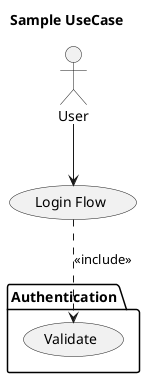
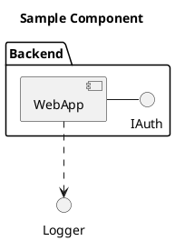

# PlantUMLAssist

PlantUML 記法の GUI 編集ツール。Python バックエンド + HTML/JS フロント。[MermaidAssist](../05_MermaidAssist) の sister project。

## 特徴

- **Tier1 ロードマップ** (対応予定): Sequence / Use Case / Class / Activity / Component / State の UML 主要6図形
- **v0.1.0** Sequence Diagram MVP / **v0.3.0** UseCase Diagram form-based MVP
- **local (Java)** がデフォルトレンダリング、**online (plantuml.com)** にもオプションで切替可能
- **DiagramModule v2** インターフェース (MermaidAssist 踏襲)
- **縦並びラベル付き追加フォーム**、DSL エディタ Tab/Shift+Tab でインデント挿入

## セットアップ

> **初回のみ**: リポジトリには PlantUML jar を同梱していません (ライセンス整合性のため)。
> 下記いずれかで `lib/plantuml.jar` を配置してください。

```bash
# macOS / Linux / WSL / Git Bash
bash lib/fetch-plantuml.sh

# Windows PowerShell
.\lib\fetch-plantuml.ps1
```

または PlantUML 公式リリース (https://github.com/plantuml/plantuml/releases) から任意の
ライセンス変種 (GPLv3 / LGPL / Apache 2.0 / EPL / MIT / BSD) を手動ダウンロードして
`lib/plantuml.jar` として配置してください。詳細は `lib/README.md` を参照。

## 起動

> **重要**: MermaidAssist と違い、HTML をダブルクリックしても動きません。PlantUML は Java 実行または plantuml.com への POST を必要とするため、Python バックエンド経由でアクセスしてください。

```bash
cd 06_PlantUMLAssist
python server.py
```

コンソールに `PlantUMLAssist server starting on http://127.0.0.1:8766` と表示されたら、ブラウザで **http://127.0.0.1:8766/** を開きます。

Windows では `start.bat` をダブルクリックでも起動可能（server.py を起動してブラウザを自動で開きます）。

**自動停止**: ブラウザタブを閉じるとサーバーも自動で停止します (heartbeat 方式、タブ close 後 2〜6秒以内に終了)。F5 リロードは自動判定で継続。明示的に止めたい場合は `Ctrl+C`。

## 要件

- Python 3 (標準ライブラリのみ、追加パッケージ不要)
- **Java 11 以降 推奨** (常駐 JVM daemon モードで高速化)
  - Java 8〜10 でも動作可能だが、自動的に毎回 JVM 起動する従来モード (低速) にフォールバック
  - online モードのみ使うなら Java 不要
- `lib/plantuml.jar` (**別途ダウンロード必要**、fetch スクリプト提供。推奨: v1.2026.2、約 22 MB)
- `lib/PlantUMLDaemon.java` (リポジトリ同梱、ビルド不要 — Java 11+ の single-file source-launcher が直接実行)

Java がインストールされていない場合は、UI 右上の `render-mode` セレクトを `online (plantuml.com)` に切替えて使用可能。plantuml.com の公開サーバを利用するため、**業務データは外部送信される**ことに注意。

### Java バージョン別の挙動

| バージョン | 動作 | 初回 render | 2回目以降 |
|---|---|---|---|
| **Java 11+** (推奨) | 常駐 daemon モード。JVM を1回だけ起動して stdin/stdout pipe 通信 | ~400ms (JVM warmup) | **~10-30ms** |
| Java 8 / 9 / 10 | 従来モード (自動フォールバック)。毎回 `java -jar plantuml.jar -pipe` を起動 | ~1.5s | ~1.5s |
| Java 未インストール | local モード使用不可。online モードは使用可 | — | — |

daemon モードでは**ネットワークソケットを一切開きません** (pipe 通信のみ)。外部から daemon プロセスにアクセスすることは OS レベルで不可能です。

### トラブルシューティング

| 症状 | 原因 | 対策 |
|---|---|---|
| "Render error: Failed to fetch" | server.py が起動していない / HTML を `file://` で開いている | `python server.py` を起動し、`http://127.0.0.1:8766/` にアクセス |
| "java not found" (local mode) | Java 未インストール | JDK/JRE 11+ をインストール (Java 8-10 でも動作するが低速)、または online モードへ切替 |
| local mode で毎回数秒かかる | Java 10 以下で daemon モードが起動できず従来モードにフォールバック | Java 11 以降 (LTS: 11 / 17 / 21) にアップグレード推奨 |
| "online render failed: HTTP 4xx/5xx" | plantuml.com のレート制限/障害 | 時間をおいて再試行、または local モードへ切替 |

## テスト

```bash
npm install
npm run test:unit   # Node runner
npm run test:e2e    # Playwright
npm run test:all
```

## UseCase Diagram (v0.3.0)

PlantUML UseCase Diagram の form-based 編集に対応。要求分析・ハザード分析・規格対応の業務フローで使用。

### 対応 DSL 要素

- `actor` (キーワード形式 / 短縮 `:Label:`)
- `usecase` (キーワード形式 / 短縮 `(Label)`)
- `package "Label" { ... }` 境界 (`rectangle` も同義として受理)
- 4 種の関係:
  - association `A --> B` (label 任意)
  - generalization `A <|-- B` (parent <|-- child 方向)
  - include `A ..> B : <<include>>`
  - extend `A ..> B : <<extend>>`

### Canonical 出力 (ADR-105)

GUI からの編集はすべて keyword-first canonical 形式で emit (例: `actor "Power User" as PU`)。短縮記法 (`:X:` / `(L)`) は parser で受理しますが、保存時に正規化されます。

### サンプル DSL



### v0.3.0 制約 (v0.5.0 で対応予定)

- SVG 要素クリック選択 (overlay-driven UI)
- ドラッグで関係作成
- 既存要素を package に範囲指定で囲む

## Component Diagram (v0.4.0)

PlantUML Component Diagram の form-based 編集に対応。システムブロック構成・モジュール依存・インターフェース表現の業務フローで使用。

### 対応 DSL 要素

- `component` (キーワード形式 / 短縮 `[X]`)
- `interface` (キーワード形式 / 短縮 `() X`)
- `port` (component 直後行に配置)
- `package "Label" { ... }` 境界 (`folder`/`frame`/`node`/`rectangle` も同義として受理)
- 4 種の関係:
  - association `A -- B` (label 任意)
  - dependency `A ..> B` (label 任意)
  - provides (lollipop) `component -() interface`
  - requires (lollipop) `interface )- component`

### Canonical 出力 (ADR-106)

GUI からの編集はすべて keyword-first canonical 形式で emit (例: `component "Web App" as WA`)。短縮記法 (`[X]` / `() X` / `folder/frame/node/rectangle`) は parser で受理しますが、保存時に正規化されます。

### サンプル DSL



### v0.4.0 制約 (v0.5.0 で対応予定)

- SVG 要素クリック選択 (overlay-driven UI)
- ドラッグで関係作成
- 既存要素を package に範囲指定で囲む

## Overlay-Driven Editing (v0.5.0)

Sequence / UseCase / Component の 3 図形は SVG プレビュー上の図形を直接クリックして編集できます。

### 共通操作

- **クリック**: 図形を単一選択 → property panel が編集モードに
- **再クリック**: 選択解除 (toggle)
- **Shift+クリック**: 複数選択 (2 つまで)
- **空白クリック**: 選択解除

### Multi-Select Connect (UseCase / Component)

2 つの図形を Shift+クリックで選択 → property panel に Connect form が出ます:

- UseCase: association / generalization / include / extend
- Component: association / dependency / provides (lollipop) / requires (lollipop)

Provides/Requires (lollipop) は方向が固定: component → interface (provides) / interface → component (requires)。Connect form は kind 切替時に自動で from/to を入れ替えます。

### v0.5.0 制約 (v0.6.0+ で対応予定)

- drag-to-connect (SVG 上で線を drag して関係作成)
- package 範囲選択 → wrap (既存要素を package で囲む)
- 要素を別 package へ drag 移動
- Sequence の multi-select connect (現状 Sequence は form-based のみ)

## 設計ドキュメント

- Design: `docs/superpowers/specs/2026-04-17-plantuml-assist-design.md`
- Plan: `docs/superpowers/plans/2026-04-17-plantuml-assist-v0.1.0.md`
- ADR: `docs/adr/` (ADR-101+)
- ECN: `docs/ecn/`

## ライセンス

本リポジトリは **MIT** (`LICENSE` 参照)。

`lib/plantuml.jar` は同梱していません。利用者が PlantUML 公式から任意のライセンス変種
(GPLv3 / LGPL / Apache 2.0 / EPL / MIT / BSD) をダウンロードして配置します。jar の
ライセンスはその配布元の条項に従い、本リポジトリのライセンスとは別扱いです。
